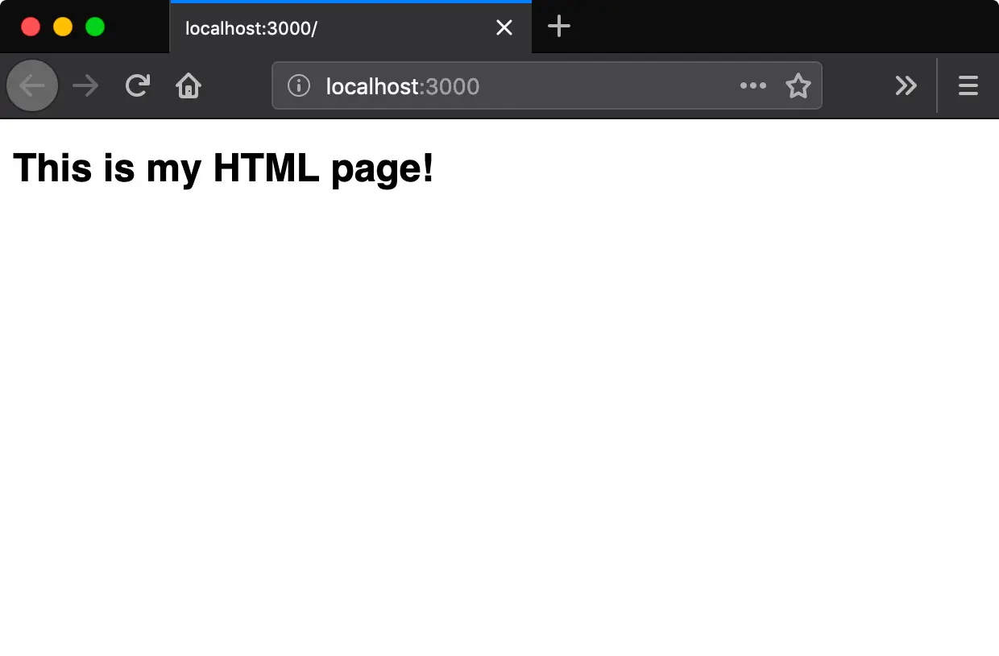
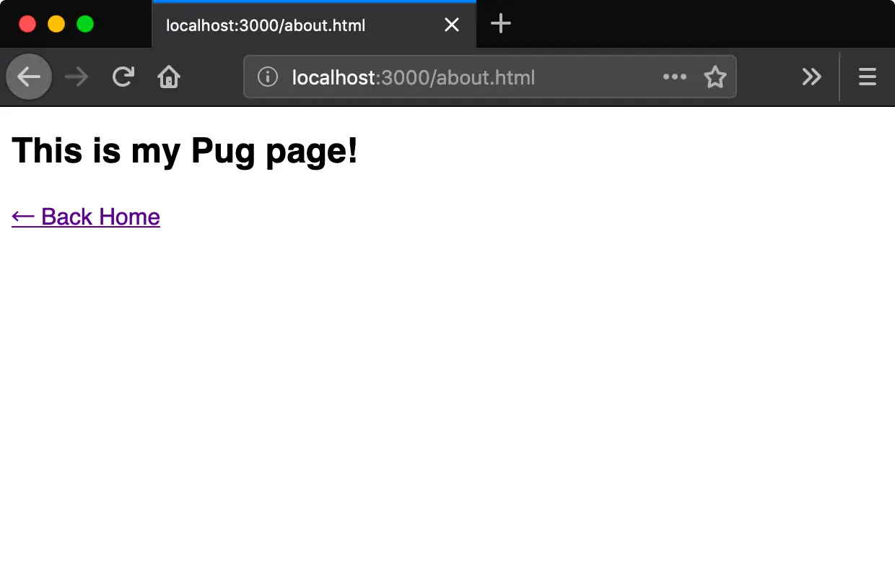
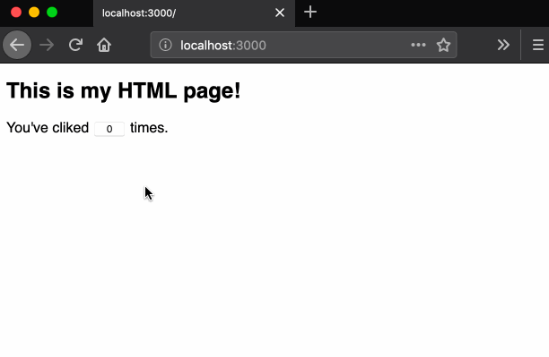
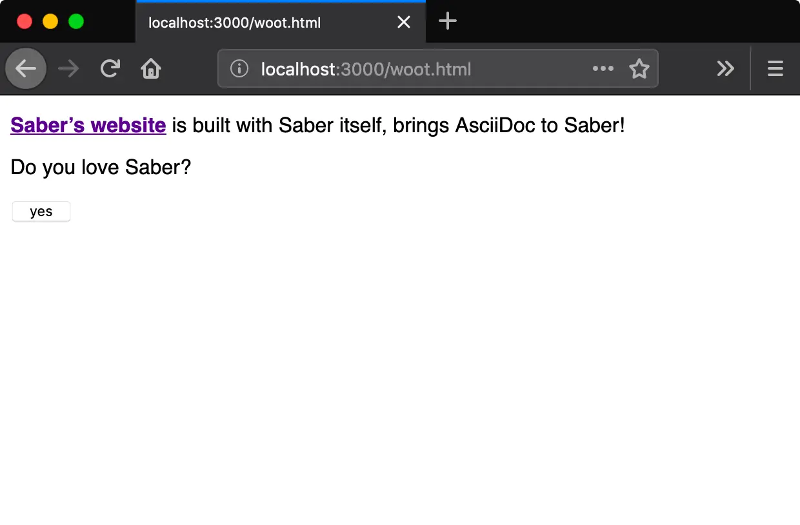

Saber by default supports `.vue` `.js` and `.md` pages, this post will introduce you `saber-plugin-transformer-html` and `saber-plugin-transformer-pug` for `.html` and `.pug` page support. You will also learn how to write a custom transformer yourself.

## Creating a New Project

Let's try out these plugins in a new project:

```bash
mkdir new-app
cd new-app
npm init -y
npm i saber -D
```

Configure the `package.json`:

```json
{
  "scripts": {
    "build": "saber build",
    "dev": "saber"
  }
}
```

## HTML Pages

Install the required plugin with npm:

```bash
npm i saber-plugin-transformer-html -D
```

Create `saber-config.js` and use this plugin:

```js
module.exports = {
  plugins: ['saber-plugin-transformer-html']
}
```

And that's it, populate a `pages/index.html`:

```html
<h2>This is my HTML page!</h2>
```

Cool, now run `npm run dev` and navigate to `http://localhost:3000`:



## Pug Pages

Install the required plugin with npm:

```bash
npm i saber-plugin-transformer-pug -D
```

Add this plugin in your `saber-config.js`:

```diff
module.exports = {
  plugins: [
    'saber-plugin-transformer-html',
+   'saber-plugin-transformer-pug'
  ]
}
```

<small><i>Note that `saber-plugin-transformer-html` is not required for writing `.pug` pages.</i></small>

Populate a `pages/about.pug`:

```pug
div
  h2 This is my Pug page!
  a(href="/") ← Back Home
```

Then navigate to `http://localhost:3000/about`:



`pages/about.pug` is mapped to `/about`, and when you click the `← Back Home` you will be redirected to the `index.html` we created in the last step.

Besides adding `.pug` page support, `saber-plugin-transformer-pug` also adds support for writing Pug in any `.vue` component:

```vue
<template lang="pug">
  div
    h2 hello
    p this is a Vue component
</template>
```

## Front Matter

Like `.md` pages, you can use front matter to define page data in `.html` and `.pug` pages as well. For example you might use a layout for `pages/index.html`:

```html
---
layout: home
---

<h2>This is my HTML page!</h2>
```

## Vue SFC Features in Pages

Like regular `.md` or `.vue` pages, you can use all [Vue single-file component features](https://vue-loader.vuejs.org/spec.html) in `.html` and `.pug` pages as well.

For example, let's create a counter in `pages/index.html`:

```html
<h2>This is my HTML page!</h2>

You've cliked <button @click="count++">{{ count }}</button> times.

<script>
  export default {
    data() {
      return {
        count: 0
      }
    }
  }
</script>
```

And it works like a charm:



## Writing A Custom Transformer

You now know that it's possible to write pages in many languages, so let's start building a custom transformer for a language you like, for example: [AsciiDoc](http://asciidoc.org/), an alternative to Markdown.

We will need two dependencies:

- `asciidoctor`: An AsciiDoc parser.
- `extract-sfc-blocks`: Extract `<script>` and `<style>` blocks from HTML.

```bash
npm install asciidoctor extract-sfc-blocks
```

Then creating a Saber plugin at `./transformer-asciidoc.js`:

```js
const asciidoctor = require('asciidoctor')()
const extractSFCBlocks = require('extract-sfc-blocks')

exports.name = 'transformer-asciidoc'

exports.apply = api => {
  // Define a new content type: asciidoc
  // Pages with extension .adoc or .asciidoc will automatically use this content type
  api.transformers.add('asciidoc', {
    extensions: ['adoc', 'asciidoc'],
    // Transform the page fro asciidoc to HTML
    transform(page) {
      // extract front matter
      const { body, frontmatter } = api.transformers.parseFrontmatter(
        page.content
      )

      // Conver AsciiDoc to HTML
      const html = asciidoctor.convert(body)

      // Extract `<script>` and `<style>` tags from HTML
      const { html: pageContent, blocks } = extractSFCBlocks(html)

      page.content = pageContent
      page.internal.hoistedTags = blocks

      // Merge front matter with page object
      Object.assign(page, frontmatter)
    },
    // Transform the page content to vue component
    getPageComponent(page) {
      return `<template>
        <layout-manager>
          ${page.content || ''}
        </layout-manager>
      </template>
      `
    }
  })
}
```

Add this plugin in your `saber-config.js`:

```diff
module.exports = {
  plugins: [
    'saber-plugin-transformer-html',
    'saber-plugin-transformer-pug',
+   './transformer-asciidoc'
  ]
}
```

Now let's create a `woot.adoc` in `pages/` folder:

```asciidoc
https://saber.land[*Saber's website*] is built with Saber itself,
brings AsciiDoc to Saber!

Do you love Saber?

++++
<button @click="yes = true">
  {{ yes ? 'thanks!' : 'yes' }}
</button>
++++

++++
<script>
export default {
  data() {
    return {
      yes: false
    }
  }
}
</script>
++++
```

<small><i>Note that to include raw HTML in your AsciiDoc code, you need to wrap them with `++++`.</i></small>

Now open `http://localhost:3000/woot.html`:



## Conclusion

In this post, we learned how to write pages in HTML or Pug. You now know that it's even possible to write a custom transformer yourself!

The entire source code for this demo is open sourced, and can be found on [GitHub](https://github.com/saber-examples/html-and-pug-pages). In case of any questions or feedback, please reach out to us via [Twitter](https://twitter.com/saber_land) or [Chat](https://chat.saber.land).
