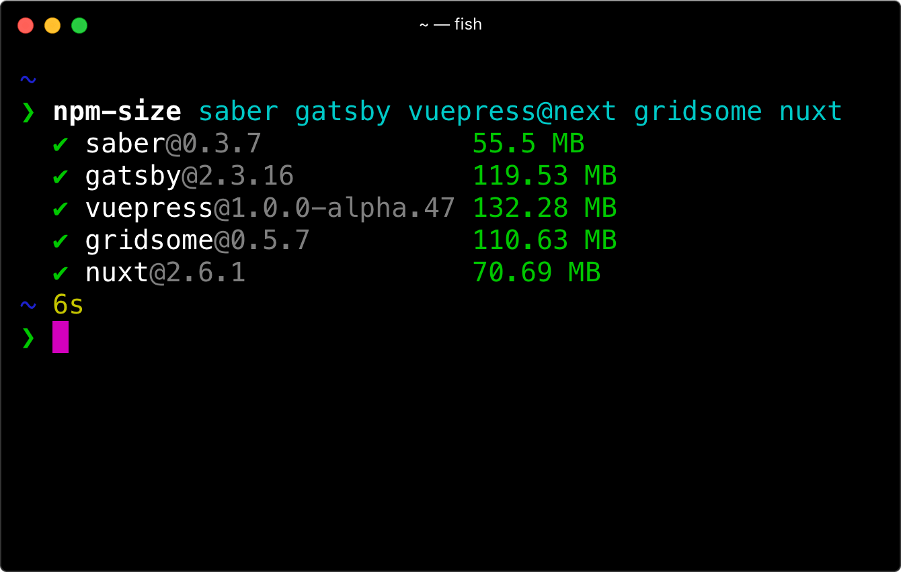

It's been two months already since the first release of Saber, but this is the first time we actually introduce it officially (excluding the [Tutorial](../../tutorial/tutorial.md)).


Saber is a tool for building static websites with modern web techs like webpack, Babel and Vue. Getting started developing an application of any size is as easy as executing `saber`.

To start using it, run inside a new directory with a `package.json`:

```bash
$ npm install saber -D
```

Populate `pages/index.md`:

```markdown
Hello **Saber**!
```

Add a script to the `package.json` like this:

```json
{
  "scripts": {
    "dev": "saber"
  }
}
```

and run:

```bash
$ npm run dev
```

## Background

The reason why I'm building Saber is simple: I love Hexo & Jekyll, but I also love using webpack & Vue, I enjoy the dev experience that you edit something and it automatically reflects in your browser, without refreshing.

Saber was previously known as [Peco](https://github.com/upash/peco) which is similar to _VuePress_ but also has the blog feature baked in. Saber is a complete rewrite that makes it possible to use data from anywhere, and it's not GraphQL based. Saber is designed to be simple, for Hexo / N[eu]xt.js users, it's even easier to get started with.

## A small framework

We want to keep the core of Saber as flexible/small as possible:



Our goal is to make Saber smaller than 50 MB.

## Zero setup. Filesystem is the routing API.

Sometimes convention over configuration is a good practice, for example, Saber uses the filesystem as the routing API, you can populate `pages/index.md` which maps to the route `/` with:

```markdown
Hello **world**!
```

and then `pages/about.vue` which maps to `/about` with:

```vue
<template>
  <h2>About us</h2>
</template>
```

All that's needed to start working on the project is to run:

```bash
$ saber
```

No configuration unless it's needed. Automatic hot-code reloading, error reporting, source maps, transpilation for older browsers.

## Blogging, Layouts & Theming

Just like Hexo, Saber uses `pages/_posts` folder for blog posts. If you populate a page at `pages/_posts/hello-world.md`, it will automatically map to `/posts/hello-world`.

Saber has all the plugins that're required for building a blog:

- If you want to display post list on your homepage, you can use [saber-plugin-query-post](https://github.com/saberland/saber/tree/master/packages/saber-plugin-query-posts) which also automatically generates _tag_ and _category_ pages.
- If you want to generate RSS feed, use [saber-plugin-feed](https://github.com/saberland/saber/tree/master/packages/saber-plugin-feed).
- Find more at [awesome-saber](https://github.com/saberland/awesome-saber) or build your own!

Check out the tutorial [Intro the Saber](../../tutorial/tutorial.md) to learn how to build a simple blog, use layouts, and share your layouts as a theme.

## Performance matters

It's wrong if it's not fast, a static website should be fast by default, but JavaScript slows it down.

The JavaScript runtime of Saber is around 40 KB minified and gzipped.

Every page inside `./pages` folder gets code splitting and their styles are inlined in the HTML.

Saber's `<saber-link>` (a drop-in replacement for Vue Router's `<router-link>`) will also prefetch the page component when user scrolls it into viewport.

For local development performance, Saber offers the Lazy Page Compilation mode which only compiles your pages when they are requested. This feature is experimental so we don't enable it by default, you can manually enable it via CLI flag `--lazy`.

---

In closing, this is my solution to building static websites with modern techs, if you like my work, please consider contributing to the project on [GitHub](https://github.com/saberland/saber), or supporting me on [Patreon](https://patreon.com/egoist)!
