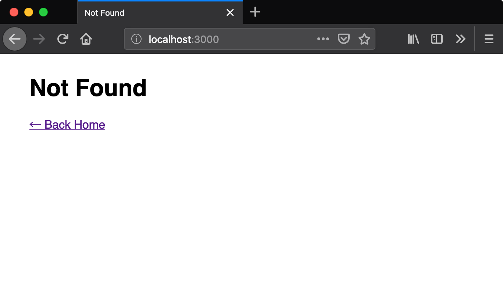
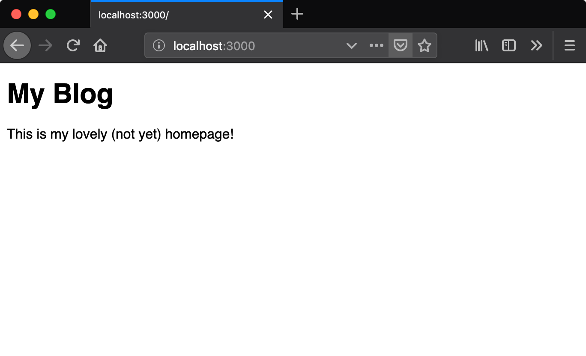
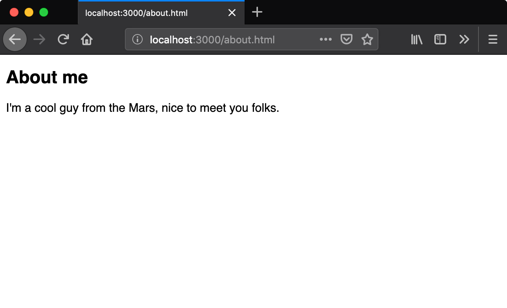
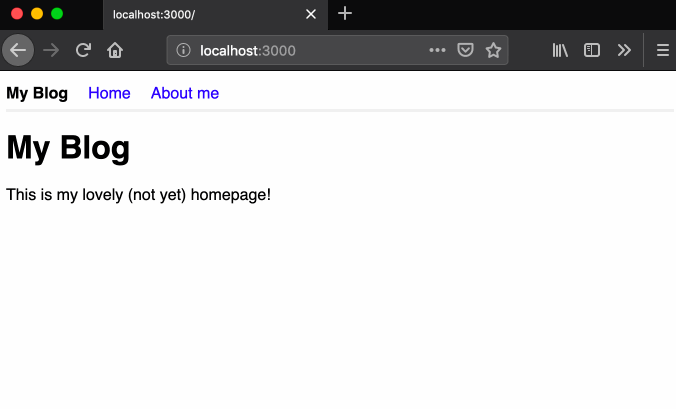
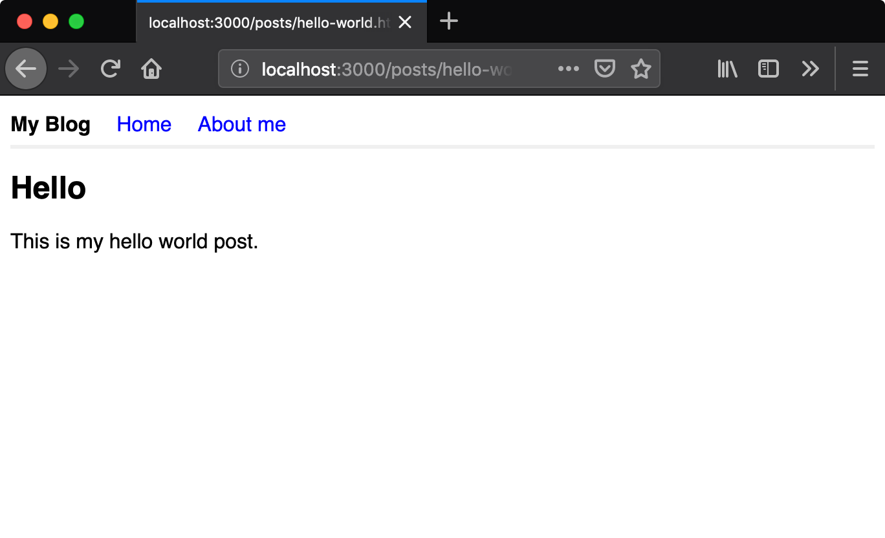
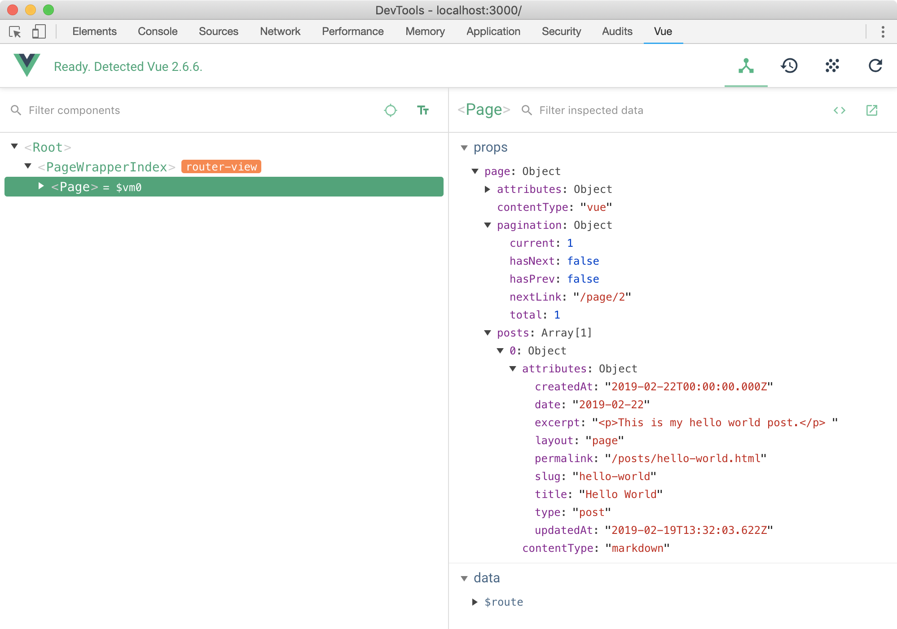
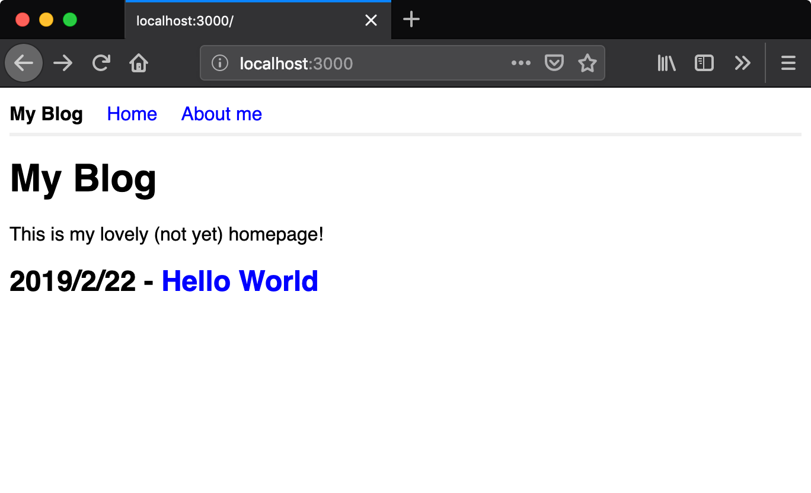
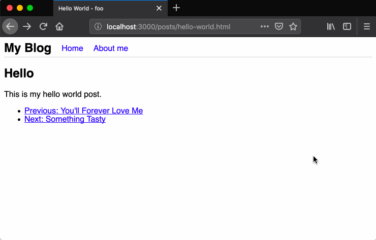

## Before We Start the Tutorial

We will build a simple blog in this tutorial. The techniques you’ll learn in the tutorial are fundamental to building any websites using Saber, and mastering it will give you a deep understanding on how Saber works.

### What Are We Building?

In this tutorial, we’ll show how to build a simple blog with Saber, you will also use [Vue](https://vuejs.org) to write a layout component for it.

### Prerequisites

You should have basic knowledge about JavaScript, Vue, Vue single-file components. Vue knowledge is not enforced but it's a requirement for writing layouts.

### Setup for the Tutorial

You need [Node.js](https://nodejs.org/en/) installed on your machine, [Yarn](https://yarnpkg.com/zh-Hans/) is our recommended package manager, you can also use Node.js's default package manager [npm](https://www.npmjs.com/) if you want.

0. Open your terminal, on Windows you can use Git Bash or Linux Sub-system.
1. Creating a new project: `mkdir my-blog`
1. Creating a `package.json`: `cd my-blog && yarn init`
1. Install Saber: `yarn add saber`

## Creating Your First Page

Try running `yarn saber` (which is a shorthand to running `./node_module/.bin/saber`) in your project, you will get a 404 page since you haven't added any pages:



Now let's create your first page `./pages/index.vue`:

```vue
<template>
  <div>
    <h1>My Blog</h1>
    <p>This is my lovely (not yet) homepage!</p>
  </div>
</template>
```

And did you notice that? You browser gets automatically reloaded to reflect the changes:



It's easy right? So why not adding another page? This time we will use Markdown to create an About page, let's populate `./pages/about.md`:

```markdown
## About me

I'm a cool guy from the Mars, nice to meet you folks.
```

And it just works:



## Adding a Navbar

Next I'd like to add a navbar to the top of our pages.

Let's create a simple `./components/Navbar.vue` component first:

```vue
<template>
  <nav>
    <h1>My Blog</h1>
    <ul>
      <li><a href="/">Home</a></li>
      <li><a href="/about.html">About me</a></li>
    </ul>
  </nav>
</template>

<style scoped>
nav {
  display: flex;
  height: 30px;
  align-items: center;
  border-bottom: 3px solid #f0f0f0;
}

/* ... omitted some css */
</style>
```

### Option 1: Manually Adding It to Every Page (dumb)

Let's try the dumb way first, later we'll introduce a smarter way.

In `./pages/index.vue`:

```vue {highlightLines:[3,10,14]}
<template>
  <div>
    <Navbar />
    <h1>My Blog</h1>
    <p>This is my lovely (not yet) homepage!</p>
  </div>
</template>

<script>
import Navbar from '../components/Navbar.vue'

export default {
  components: {
    Navbar
  }
}
</script>
```

Guess what, you can use components in Markdown files as well, in your `./pages/about.md`:

```markdown {highlightLines:[1,'7-15']}
<Navbar />

## About me

I'm a cool guy from the Mars, nice to meet you folks.

<script>
import Navbar from '../components/Navbar.vue'

export default {
  components: {
    Navbar
  }
}
</script>
```

Let's see it in action:



### Option 2: Using Layout Components (smart)

Imagine you have tens of pages and you need to repeat the above steps 10x times, it will be a disaster!

Luckily you can get over this by using layout components, a layout component will receive the page component as default slot, to use layouts you need to populate Vue components inside `./layouts` directory in your project root.

Here we want to create a layout named `page` to show `Navbar` component, so we populate a `./layouts/page.vue`:

```vue
<template>
  <div>
    <Navbar />
    <slot name="default" />
  </div>
</template>

<script>
import Navbar from '../components/Navbar.vue'

export default {
  components: {
    Navbar
  }
}
</script>
```

Then you need to make your pages use this layout.

In your `./pages/index.vue`:

```vue {highlightLines:['9-11']}
<template>
  <div>
    <h1>My Blog</h1>
    <p>This is my lovely (not yet) homepage!</p>
  </div>
</template>

<script>
export const data = {
  layout: 'page'
}

export default {}
</script>
```

In your `./pages/about.md`:

```markdown {highlightLines:[2]}
---
layout: page
---

## About me

I'm a cool guy from the Mars, nice to meet you folks.
```

The front matter in Markdown page and the `export const data` part in `.js` and `.vue` pages are used by the page component to communicate with its layout component and the layout system.

Nice, now you achieved the same thing without repeating yourself!

## Creating Your First Post

You can't create a blog without writing actual posts right? In Saber, posts are also pages, but they are kinda special, you need to populate them in `./pages/_posts` directory.

We'll start with the classic Hello World post, let's create `./pages/_posts/hello-world.md`:

```markdown
---
title: Hello World
date: 2019-02-22
layout: page
---

## Hello

This is my hello world post.
```

And then go to http://localhost:3000/posts/hello-world.html:



## Showing Posts on the Homepage

We need a plugin called `saber-plugin-query-posts` to inject all posts to your homepage:

```bash
yarn add saber-plugin-query-posts
```

Create a `saber-config.yml` to use this plugin:

```yaml
plugins:
  - resolve: saber-plugin-query-posts
```

Then tell your homepage `pages/index.vue` that it wants the post list to be injected:

```vue {highlightLines:[11]}
<template>
  <div>
    <h1>My Blog</h1>
    <p>This is my lovely (not yet) homepage!</p>
  </div>
</template>

<script>
export const data = {
  layout: 'page',
  injectAllPosts: true
}

export default {}
</script>
```

Now there will be a `posts` property under the `page` prop, you can access the `page` prop from the page itself (if no layout is specified) or its layout component, you can open Vue Devtools in your browser to inspect the `page` prop:



Awesome, now let's update the `./layouts/page.vue` to show recent posts:

```vue {highlightLines:['5-16',27]}
<template>
  <div>
    <Navbar />
    <slot name="default" />
    <div class="recent-posts" v-if="page.posts">
      <ul>
        <li v-for="post in page.posts" :key="post.permalink">
          <h2>
            {{ formatDate(post.createdAt) }} -
            <a :href="post.permalink">{{
              post.title
            }}</a>
          </h2>
        </li>
      </ul>
    </div>
  </div>
</template>

<script>
import Navbar from '../components/Navbar.vue'

export default {
  components: {
    Navbar
  },
  props: ['page'],
  methods: {
    formatDate(v) {
      const date = new Date(v)
      return `${date.getFullYear()}/${date.getMonth() + 1}/${date.getDate()}`
    }
  }
}
</script>

<style scoped>
.recent-posts ul {
  margin: 0;
  padding-left: 0;
  list-style: none;
}

.recent-posts a {
  color: blue;
  text-decoration: none;
}
</style>
```

If you have more than 30 posts you can add pagination based on the `page.pagination` value which is also injected by `saber-plugin-query-posts` , we only have one so it doesn't matter for now:



## Adding Document Title

Everything seems to work fine now, but I just notice that our pages don't have browser tab titles, let's add a quick fix to the layout `./layouts/page.vue`:

```vue {highlightLines:['9-16']}
<template>
  <div><!-- ..omitted --></div>
</template>

<script>
export default {
  // ..omitted
  props: ['page'],
  head() {
    const pageTitle = this.page.title
    return {
      title: pageTitle ?
        `${pageTitle} - ${this.$siteConfig.title}` :
        this.$siteConfig.title
    }
  }
}
</script>

<style scoped>
/* ..omitted */
</style>
```

You can use `head` option to manage tags in `<head>`, this feature is powered by [vue-meta](https://github.com/nuxt/vue-meta) which is maintained and used Nuxt.js.

Note that `this.$siteConfig` is the value of `siteConfig` property from your Saber config file, for example in your `saber-config.yml` add:

```yaml
siteConfig:
  title: My Blog
```

## Showing Previous and Next Post

It's common for a blog to show related posts on the post page, here we're going to show previous and next post.

First let's create two more posts so that we have enough posts to implement this feature.

Like the `saber-plugin-query-posts` plugin we used previously, now we need to inject two properties `prevPost` and `nextPost` to the `page` prop, all by ourselves.

To do so we need to create a `saber-node.js` in the project root to access Saber's Node.js APIs:

```js
// saber-node.js
exports.onCreatePages = function() {
  // Do something...
}
```

The `onCreatePages` export lets you execute a function when all pages are added to Saber's data source.

```js
// saber-node.js
exports.onCreatePages = function() {
  // Pages are read into the `this.pages` Map
  // Sort posts by createdAt (date) from new to old
  const posts = [...this.pages.values()]
    .filter(page => page.type === 'post' && !page.draft)
    .sort((a, b) => {
      return a.createdAt > b.createdAt ? 1 : -1
    })
  const selectFields = page => (page && {
    title: page.title,
    permalink: page.permalink
  })
  for (const [index, post] of posts.entries()) {
    post.prevPost = selectFields(posts[index - 1])
    post.nextPost = selectFields(posts[index + 1])
  }
}
```

Now adding following markup to the `page` layout to show previous / next post:

```vue
<ul>
  <li v-if="page.prevPost">
    <router-link :to="page.prevPost.permalink">
      Previous: {{ page.prevPost.title }}
    </router-link>
  </li>
  <li v-if="page.nextPost">
    <router-link :to="page.nextPost.permalink">
      Next: {{ page.nextPost.title }}
    </router-link>
  </li>
</ul>
```

Tada! 🎉



## Adding Progress Bar for Page Loading

Each page in `./pages` will be lazy-loaded at runtime, i.e. your browser will only download specific code when it's needed. Therefore a progress bar for page loading will certainly improve user experience.

[nprogress](https://github.com/rstacruz/nprogress) is a JavaScript library that provides YouTube-like progress bar, in this case, we need to access Saber's router API to use nprogress. You can export a function in `saber-browser.js` to extend Saber's browser APIs:

```js {highlightLines:[13,21]}
export default ({ router }) => {
  // Progress bar is not needed on server-side
  if (process.browser) {
    // These dependencies are only bundled in client build
    const nprogress = require('nprogress')
    require('nprogress/nprogress.css')

    const loaded = Object.create(null)

    router.beforeEach((to, from, next) => {
      if (!loaded[to.path]) {
        // Start progress bar before entering page
        nprogress.start()
      }
      next()
    })

    router.afterEach(to => {
      loaded[to.path] = true
      // Stop progress bar after entering page
      nprogress.done()
    })
  }
}
```

For details on Saber's browser APIs, check out [the reference](/docs/browser-apis.html).

## Creating A Theme

You can move your layouts, `saber-browser.js` and `saber-node.js` into their own directory, the directory is the so-called *theme* directory.

To use a local theme, configure it in `saber-config.yml` like this:

```yaml
# A local directory
theme: ./src
```

Previously you had your layouts populated in `$projectRoot/layouts` directory, now move it to `$theme/layouts`. If you want others to use it as well, publish the theme directory on npm and follow the `saber-theme-[name]` naming convention, you can use an npm package as theme like this:

```yaml
# An npm package named `saber-theme-simple`
theme: simple
```

Note that `$projectRoot/layouts` directory still works even if you're using a theme, the layouts in this directory take higher priorty over the layouts in the theme directory. For instance, `$theme/layouts/foo.vue` will be ignored if `$projectRoot/layouts/foo.vue` exists.

## Building for Production

Run `yarn saber generate` in your project, the output website can be found at `public` directory, then you can run `yarn saber serve` to preview the production build locally. You can also directly deploy this directory to GitHub pages or Netlify.
